# Note-Taking-app
A simple and intuitive app for creating, editing, and organizing notes and todos.

# Build Instructions
## Build and run server in docker
- Go to the root directory of the project and run the following command:
```bash
docker compose up -d --build
```
- Whait for the server to build and run successfully.
You can see the logs of the server by running the following command:
```bash
docker compose logs
```
- When you see the following message in the logs, the server is ready to accept requests:
```
migration-service  | Done.
```
## Build and run client
- Use visual studio to compile and run the client for android or windows.
  - For android, you need to change the IP address in the `appsettings.json` file to the IP address of the server.
- When the server is not connected to the client, the client will show a message that says And give you the option to enter the IP address of the server or exit the app.

# Example of the Android client
### Home
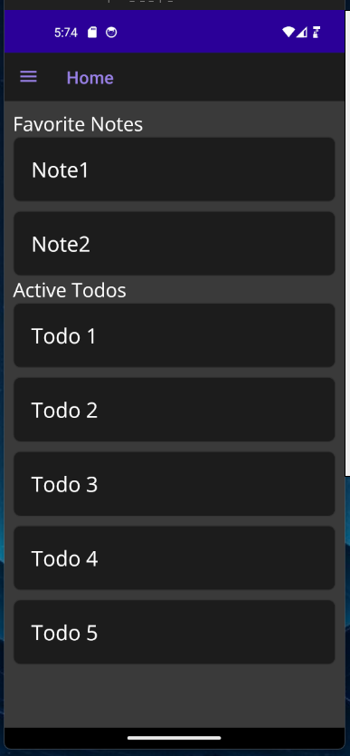

### Notes
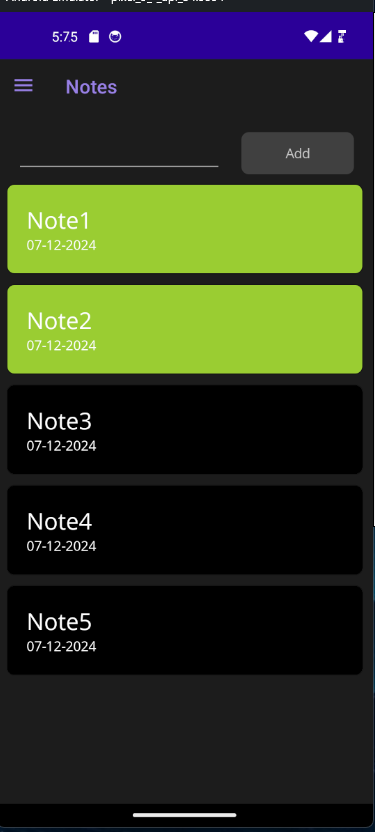
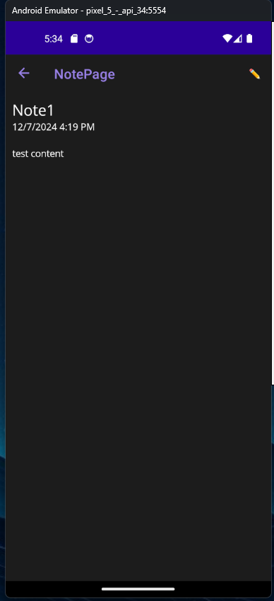
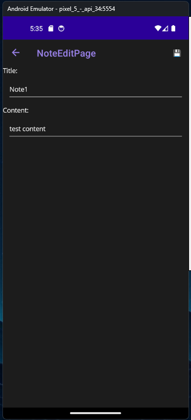

### Todos
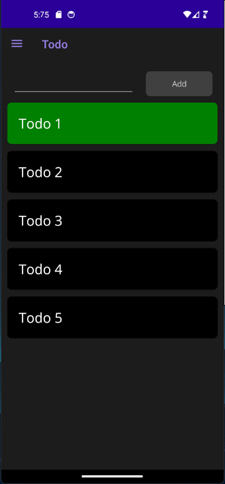
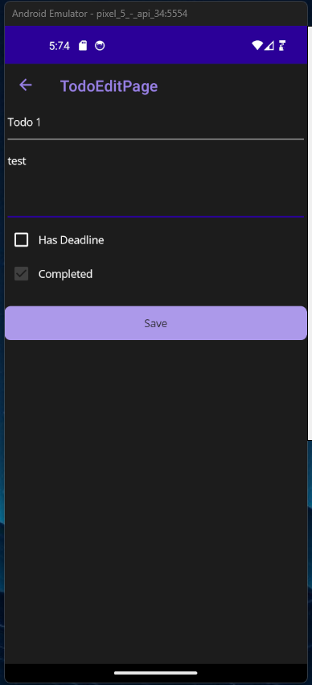

# Example of the Windows client
### Home
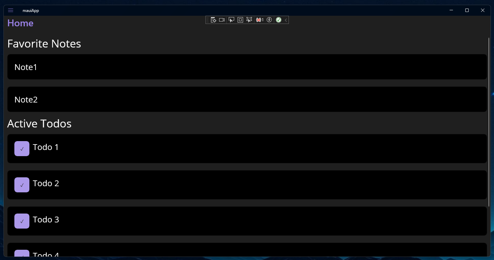

### Notes
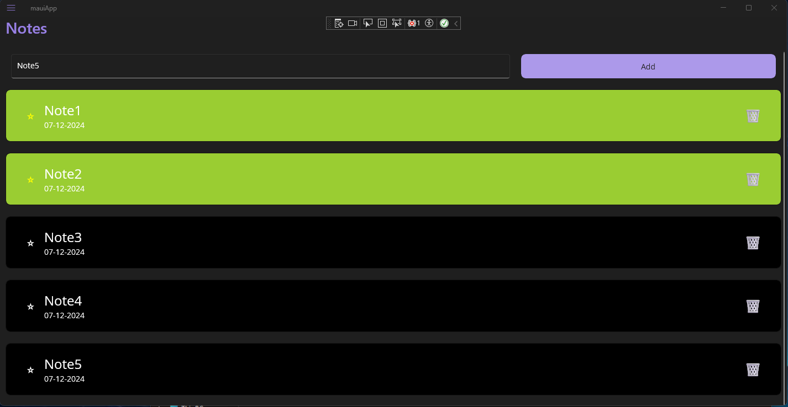
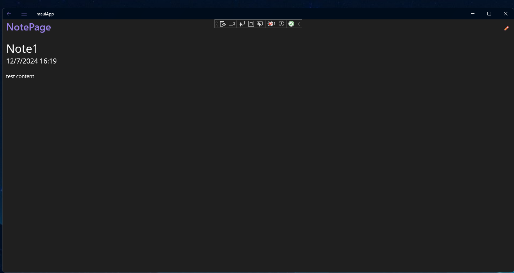
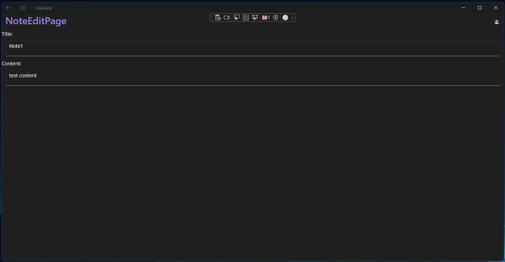

### Todos
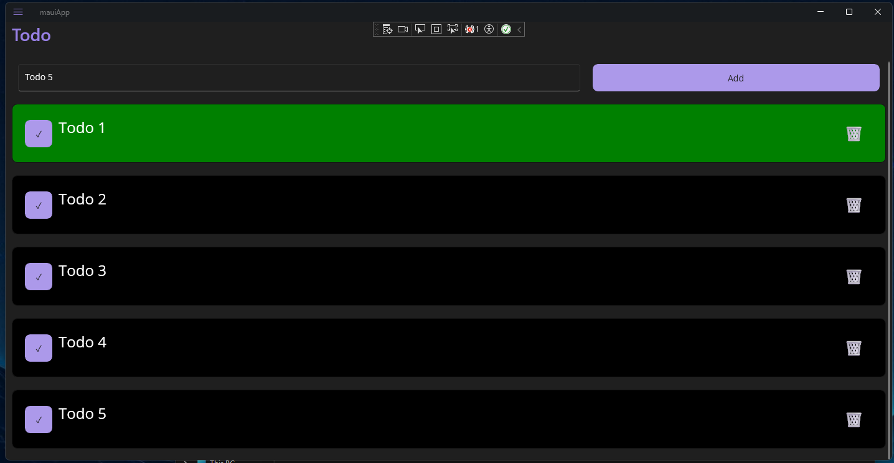
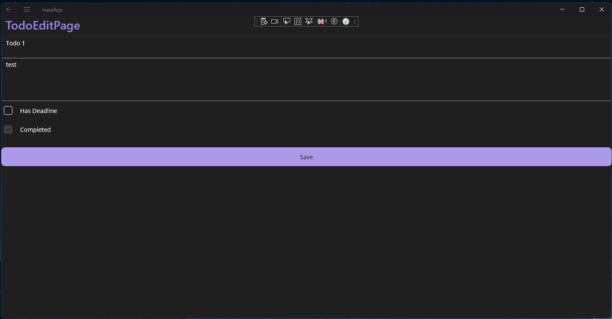

[](https://classroom.github.com/a/1k7fPbWD)
